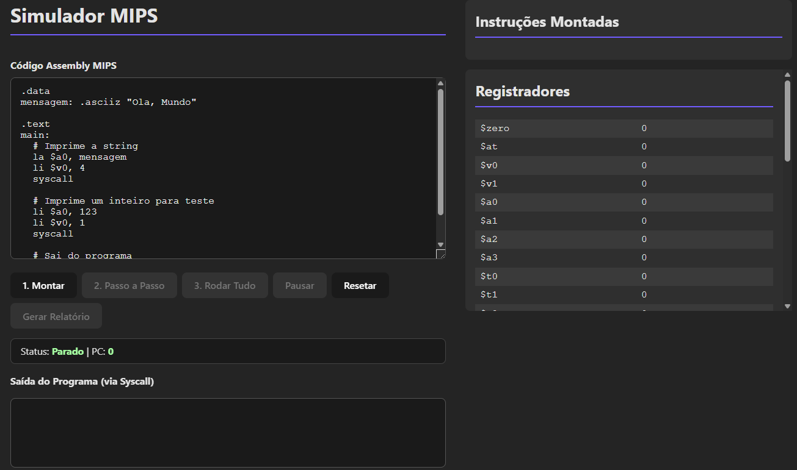

# ALUNOS: Pedro Reis, André Nacamura

[Utilize o site aqui!](https://plreis.github.io/Assembler-Mips/)



# Simulador de Processador MIPS em React

Este projeto é um simulador interativo para um subconjunto da arquitetura MIPS de 32 bits, desenvolvido com React e Vite. Ele permite escrever, montar (assemblar) e executar código Assembly MIPS em uma interface gráfica, visualizando o estado dos registradores e a saída do programa em tempo real.

O simulador foi projetado com base no datapath clássico de ciclo único, implementando a lógica para decodificar e executar instruções do tipo R e do tipo I.

## Funcionalidades

*   **Editor de Código Assembly:** Escreva seu código MIPS com suporte a comentários e seções `.data` e `.text`.
*   **Montador (Assembler):** Converte o código Assembly em código de máquina binário de 32 bits, exibido no formato de campo MIPS (`op rs rt rd shamt funct`).
*   **Controle de Execução:**
    *   **Passo a Passo:** Execute uma instrução por vez para uma depuração detalhada.
    *   **Rodar Tudo:** Execute o programa inteiro automaticamente.
    *   **Pausar e Resetar:** Controle total sobre o fluxo de execução.
*   **Visualização em Tempo Real:**
    *   **Registradores:** Monitore o valor dos 32 registradores MIPS.
    *   **Instruções:** Veja a instrução atual (PC) destacada na lista de código montado.
    *   **Console de Saída:** Observe a saída gerada por chamadas de sistema (`syscall`).
*   **Suporte a Dados:** Defina strings na seção `.data` usando a diretiva `.asciiz` e carregue seus endereços com a pseudo-instrução `la`.
*   **Relatório Final:** Gere um arquivo de texto com o estado final dos registradores ao final da execução.

## Como Executar o Projeto

Para executar o simulador em sua máquina local, siga os passos abaixo.

### Pré-requisitos

*   **Node.js:** É necessário ter o Node.js instalado. Você pode baixá-lo em [nodejs.org](https://nodejs.org/). O `npm` (Node Package Manager) é instalado junto com o Node.js.

### Passos de Instalação e Execução

1.  **Clone o Repositório**
    ```bash
    git clone https://github.com/plreis/Assembler-Mips
    cd Assembler-Mips
    ```

2.  **Instale as Dependências**
    Execute o comando abaixo na raiz do projeto para instalar as bibliotecas necessárias (como React).
    ```bash
    npm install
    ```

3.  **Inicie o Servidor de Desenvolvimento**
    Este comando irá iniciar a aplicação em modo de desenvolvimento e abri-la no seu navegador padrão.
    ```bash
    npm run dev
    ```
    A aplicação estará disponível em `http://localhost:5173` (ou em outra porta, se a 5173 estiver ocupada).

## Instruções Implementadas

O simulador suporta o seguinte subconjunto de instruções MIPS:

| Categoria             | Instrução                   | Exemplo                               |
| --------------------- | --------------------------- | ------------------------------------- |
| **Aritmética/Lógica** | `add`, `sub`, `and`, `or`   | `add $t0, $s1, $s2`                   |
|                       | `addi`                      | `addi $t0, $s1, 100`                  |
|                       | `mult` (sem HI/LO)          | `mult $s0, $s1`                       |
|                       | `sll` (Shift Left Logical)  | `sll $t0, $s1, 2`                     |
| **Transferência**     | `lw` (Load Word)            | `lw $t0, 4($s0)`                      |
|                       | `sw` (Store Word)           | `sw $t0, 8($s0)`                      |
|                       | `lui` (Load Upper Immediate) | `lui $t0, 255`                        |
| **Condicional**       | `slt` (Set on Less Than)    | `slt $t0, $s1, $s2`                   |
|                       | `slti` (Set on Less Than Imm) | `slti $t0, $s1, 50`                   |
| **Pseudo-Instruções** | `li` (Load Immediate)       | `li $t0, 123`                         |
|                       | `la` (Load Address)         | `la $a0, minha_label`                 |
|                       | `move`                      | `move $t0, $t1`                       |

### Chamadas de Sistema (`syscall`)

| `$v0` | Serviço            | Descrição                                                              |
| ----- | ------------------ | ---------------------------------------------------------------------- |
| `1`   | **Imprimir Inteiro** | Imprime o inteiro armazenado em `$a0`.                                 |
| `4`   | **Imprimir String**  | Imprime a string terminada em nulo cujo endereço está em `$a0`.        |
| `10`  | **Sair**           | Finaliza a execução do programa.                                       |

---

## Exemplos de Código

Copie e cole um dos exemplos abaixo no editor do simulador para testar.

### Exemplo 1: Olá, Mundo! (String e Inteiro)

```mips
# Imprime uma string e um número.

.data
mensagem: .asciiz "O numero magico eh: "

.text
main:
  # Imprime a string definida em .data
  la $a0, mensagem
  li $v0, 4
  syscall

  # Imprime um inteiro
  li $a0, 42
  li $v0, 1
  syscall

  # Finaliza
  li $v0, 10
  syscall

  ```


  ```mips

  # Realiza um cálculo simples e usa slt para comparar o resultado.

.data
msg_maior: .asciiz "O resultado eh maior que 50."
msg_menor: .asciiz "O resultado eh menor ou igual a 50."

.text
main:
  li $t0, 25
  li $t1, 30
  add $s0, $t0, $t1   # s0 = 25 + 30 = 55

  slti $t2, $s0, 51   # t2 = (55 < 51) ? 1 : 0.  t2 será 0.

  la $a0, msg_maior
  li $v0, 4
  syscall

  # Finaliza o programa
  li $v0, 10
  syscall
```

  ```mips

  # Salva um valor na memória e o carrega de volta para outro registrador.

.data
mem_local: .space 4  # Reserva 4 bytes (espaço para uma word)
msg:       .asciiz "Valor salvo e recarregado da memoria: "

.text
main:
  # Carrega o endereço da nossa variável de memória
  la $s0, mem_local

  # Armazena o valor 1234 na memória
  li $t0, 1234
  sw $t0, 0($s0)

  # Limpa t0 para provar que o valor será lido da memória
  li $t0, 0

  # Carrega o valor da memória em t1
  lw $t1, 0($s0)

  # Imprime a mensagem e o valor lido
  la $a0, msg
  li $v0, 4
  syscall

  move $a0, $t1
  li $v0, 1
  syscall

  # Fim
  li $v0, 10
  syscall
  ```